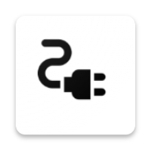

# DESCO BD - Electricity Management App

  
  <h3>Secure Electricity Account Management for Dhaka Electric Supply Company</h3>
  
Track consumption, manage recharge history, and stay connected with your electricity account

---

## 📱 About DESCO BD

DESCO BD is a comprehensive mobile application designed for Dhaka Electric Supply Company (DESCO) customers in Bangladesh. The app provides secure and efficient electricity account management, allowing users to monitor consumption, track recharge history, and manage their electricity accounts with ease.

### 🎯 Key Benefits
- **Real-time Monitoring**: Track electricity consumption in real-time
- **Secure Management**: Advanced security features for account protection
- **Multi-language Support**: Available in English and Bengali
- **Offline Access**: View account information without internet connection
- **Smart Notifications**: Get alerts for low balance and important updates

---

## ✨ Features

### 🔥 Core Features

#### 📊 Real-time Consumption Tracking
- Monitor electricity consumption in real-time
- Detailed monthly and daily usage analytics
- Visual charts and consumption patterns
- Year-over-year comparisons

#### 📋 Recharge History
- Complete transaction history
- Detailed payment records
- Easy-to-navigate history interface
- Export capabilities

#### 🔒 Secure Account Management
- Advanced security features
- Secure authentication system
- Data protection protocols
- Safe account access

#### 🔔 Smart Notifications
- Low balance alerts
- Important account updates
- Customizable notification settings
- Push notification support

#### 🌐 Multi-language Support
- English interface
- Bengali (বাংলা) interface
- Easy language switching
- Localized content

#### 🌙 Dark Mode
- Light and dark theme options
- Comfortable viewing in any lighting
- Automatic theme switching
- Customizable appearance

### 🚀 Advanced Features

#### 📈 Detailed Analytics
- Monthly consumption charts
- Usage pattern analysis
- Consumption trend tracking
- Comprehensive insights

#### 📱 Offline Access
- View cached account data
- Offline data viewing
- Automatic sync when online
- No internet required for basic features

#### ⚙️ Smart Automation
- Smart notifications
- Balance alerts
- Automatic data updates
- Customizable automation

---

## 📥 Download & Installation

### System Requirements
- **Platform**: Android
- **Android Version**: 5.0+ (API level 21+)
- **Storage**: 50MB free space
- **Internet**: Required for account sync and updates

### Download Options

#### 🎯 Direct Download
- **Latest Version**: [Download APK](https://github.com/tuhinx/desco-bd/releases/latest)
- **File Size**: ~25MB
- **Security**: 100% Secure and Free

#### 📱 Installation Steps
1. Download the APK file from the latest release
2. Enable "Install from Unknown Sources" in Android settings
3. Open the downloaded APK file
4. Follow the installation prompts
5. Launch the app and create your account

---

## 🛡️ Security & Privacy

### Security Features
- **End-to-End Encryption**: All data transmission is encrypted
- **Secure Authentication**: Multi-factor authentication support
- **Data Protection**: Your personal information is protected
- **Regular Updates**: Security patches and improvements

### Privacy Policy
- **Data Collection**: No personal data is collected
- **Data Usage**: App functions without collecting user information
- **Data Sharing**: No data is shared with third parties
- **Data Storage**: No user data is stored on external servers

---

## 🎨 User Interface

### Design Philosophy
- **User-Friendly**: Intuitive and easy-to-navigate interface
- **Modern Design**: Clean and contemporary UI/UX
- **Responsive**: Optimized for all screen sizes
- **Accessibility**: Designed for users with disabilities

### Theme Options
- **Light Theme**: Clean and bright interface
- **Dark Theme**: Easy on the eyes in low light
- **Customizable**: Personalize your experience

---

## 🔧 Technical Specifications

### App Information
- **App Name**: DESCO BD
- **Developer**: Tuhinx
- **Platform**: Android

### Performance
- **Fast Loading**: Optimized for quick startup
- **Low Memory**: Efficient resource usage
- **Battery Friendly**: Minimal battery consumption
- **Smooth Performance**: 60fps animations

---

## 📞 Contact Information

### Developer Contact
- **Developer**: Tuhinx
- **GitHub**: [@tuhinx](https://github.com/tuhinx)
- **Repository**: [DESCO BD](https://github.com/tuhinx/desco-bd)
- **Facebook**: [Tuhinx BD](https://facebook.com/tuhinxbd)

### Support & Help
- **Bug Reports**: Report issues via GitHub Issues
- **Feature Requests**: Suggest new features via GitHub
- **General Inquiries**: Contact through GitHub or Facebook

---

  
<strong>Made with ❤️ for DESCO customers in Bangladesh</strong>

  
© 2025 DESCO BD. All rights reserved.

